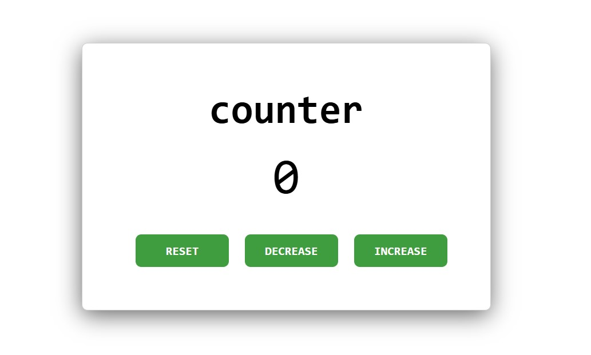

# Counter App

This is a simple JavaScript counter app that allows users to increase, decrease, or reset the counter value. The current value of the counter is displayed in the center of the screen and can be updated using the three buttons below it: "Increase", "Decrease", and "Reset".

## Features

- **Increase**: Adds 1 to the counter value.
- **Decrease**: Subtracts 1 from the counter value.
- **Reset**: Sets the counter value back to 0.

## How to Run

1. Clone this repository to your local machine.
2. Open the `index.html` file in your browser to see the app in action.

## Technologies Used

- **HTML** for structuring the page.
- **CSS** for styling the layout and buttons.
- **JavaScript** for handling counter logic and updating the display.

