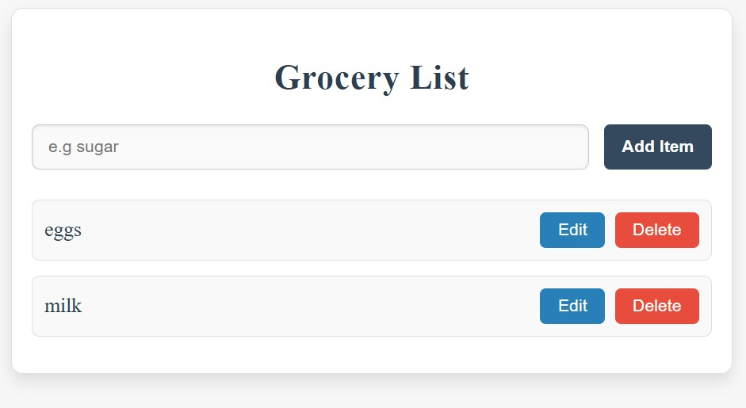

# Grocery List Application

A simple Grocery List web app built using HTML, CSS, and JavaScript. This app allows users to add, edit, and delete grocery items, and it demonstrates the use of basic DOM manipulation, event handling, and local storage.

## Features

- **Add Items**: Users can add new grocery items to the list.
- **Edit Items**: Users can edit existing grocery items.
- **Delete Items**: Users can remove items from the list.
- **Responsive**: The app is mobile-friendly and works on both desktop and mobile devices.

## Technologies Used

- **HTML**: Structure of the web page.
- **CSS**: Styling and layout.
- **JavaScript**: Functionality for adding, editing, and deleting items.

##  demo

