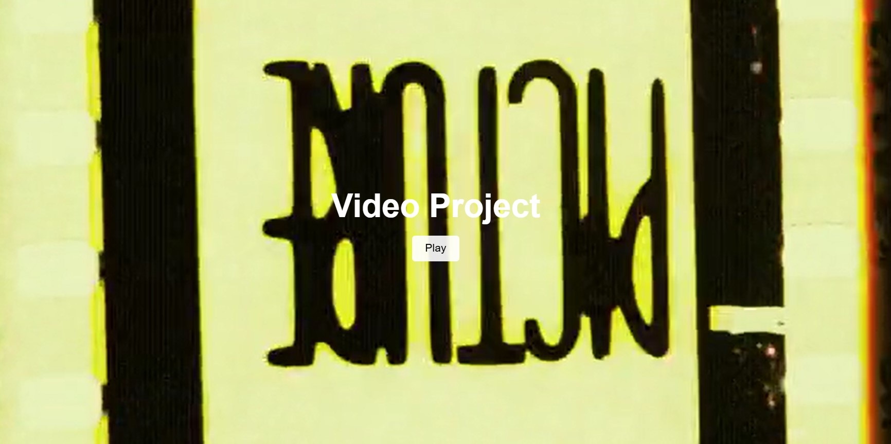

# Video Project

This project features a background video with a **play/pause button** that allows users to control the video playback. The button allows users to toggle between playing and pausing the video. When the video is playing, the button shows a **pause button**, and when it is paused, it shows a **play button**.

## Features

- **Play/Pause Button**: Controls the video playback by toggling between play and pause states.
  - **Play**: Starts the video and shows a **pause** button.
  - **Pause**: Stops the video and shows a **play** button.
  
## How to Run

1. Clone this repository to your local machine.
2. Open the `index.html` file in your browser to see the video with the play/pause button in action.

## Technologies Used

- **HTML** for structuring the page and embedding the video.
- **CSS** for styling the layout, video container, and buttons.
- **JavaScript** for handling the video playback logic and controlling the button's state.

