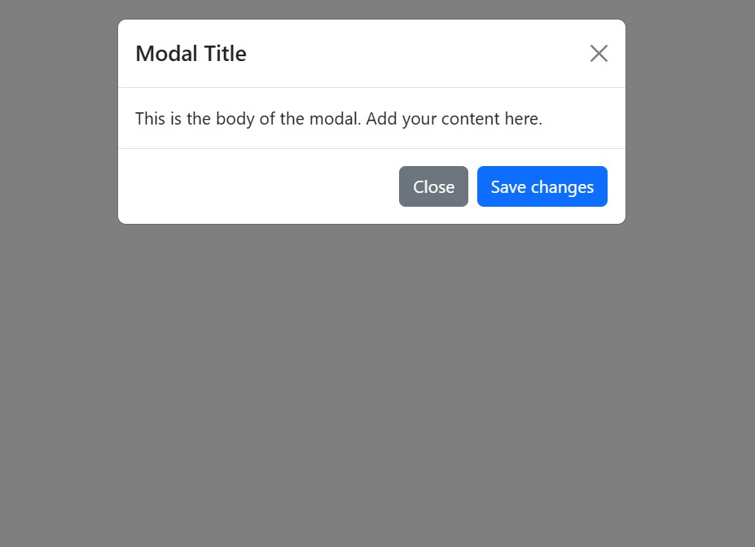

# Modal Window
This modal window project that demonstrates how to create an interactive overlay for highlighting important information or prompting user action. Built using Bootstrap, it uses prebuilt classes for simplicity and responsiveness.

---

---
