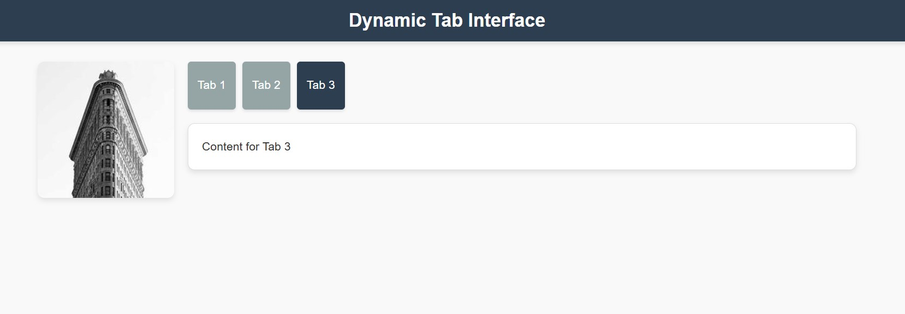

### Dynamic Tab Interface

A modern and responsive dynamic tab interface built with **HTML**, **CSS**, and **JavaScript**. This project features a random image loader, styled navigation-like tabs, and responsive content switching.

## Features

- **Dynamic Tabs:** Switch between pre-existing content dynamically.
- **Random Image:** Displays a random image from [Picsum](https://picsum.photos/200) every time the page loads.
- **Responsive Design:** Optimized for both desktop and mobile devices.
- **Interactive Buttons:** Professionally styled navigation buttons with hover effects.
- **Modern Aesthetic:** Clean and modern UI with subtle animations and rounded corners.

## Preview

## Technologies Used

- **HTML**: Structure of the interface.
- **CSS**: Styling and layout.
- **JavaScript**: Dynamic functionality for tab switching.

